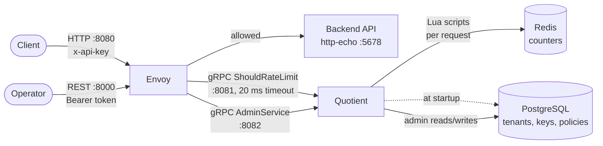
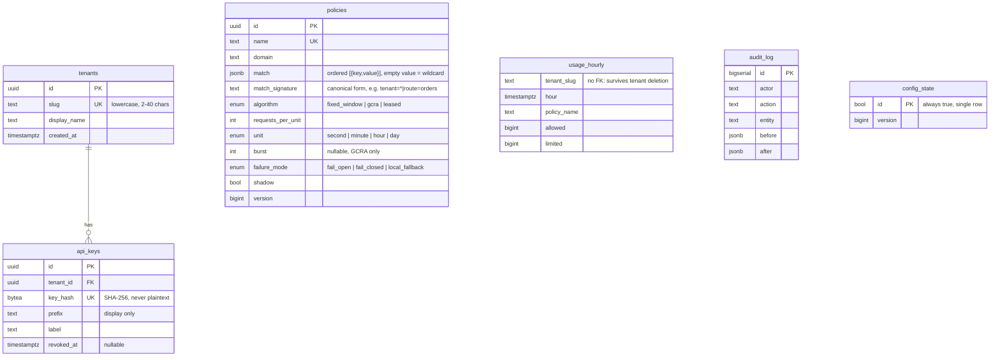
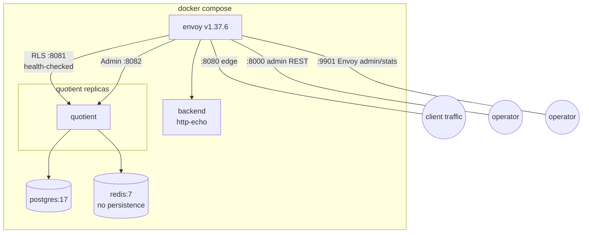

# Quotient — Architecture

Quotient is a global rate-limiting and quota service that implements Envoy's
Rate Limit Service (RLS) v3 gRPC API. Envoy asks Quotient "may this client make
this call?" on every request; Quotient answers `OK` or `OVER_LIMIT` by checking
a policy against a counter in Redis. Tenants, API keys and policies are
configuration, stored in PostgreSQL and loaded into memory at startup.

This document describes the system as it exists today (see the repository
README's [Project status](../README.md#project-status) table for what is done
vs. planned).

## 1. System context



Five processes make up the demo stack (`deploy/docker-compose.yml`): Envoy,
Quotient, PostgreSQL, Redis, and a `http-echo` stand-in for the protected
backend. Quotient itself is stateless — every Quotient replica can serve any
request, because the two pieces of state that matter (counters, configuration)
live outside the process.

## 2. Three request paths

Quotient exposes three separate gRPC services on three separate listeners.
Keeping them apart means a burst of admin traffic can never starve the hot
path, and a slow admin RPC can never affect the 20 ms rate-limit deadline.

| Path | Listener | Proto service | Called by | Frequency |
|---|---|---|---|---|
| Hot path | `:8081` | `envoy.service.ratelimit.v3.RateLimitService` | Envoy's `envoy.filters.http.ratelimit` filter | Every proxied request |
| Admin path | `:8082` | `quotient.admin.v1.AdminService` | Envoy's gRPC-JSON transcoder (`:8000`), or gRPC directly | Rare, operator-driven |
| Control path | none (in-process) | — | Quotient itself, at startup | Once, plus a manual restart to pick up changes |

### 2.1 Hot path — `ShouldRateLimit`

1. Envoy's HTTP connection manager matches the route (`/v1/orders` or `/`) and
   builds one or more **descriptors** from the request, per `gateway/envoy.yaml`
   — ordered lists of `{key, value}` pairs such as `[api_key=qk_demo_acme]` or
   `[api_key=qk_demo_acme, route=orders]`. A third descriptor,
   `[header_match=no_api_key]`, is generated when the `x-api-key` header is
   absent.
2. Envoy calls `RateLimitService/ShouldRateLimit` with all descriptors for the
   request in one call, a 20 ms timeout, and `failure_mode_deny: false` (fail
   open if Quotient doesn't answer in time).
3. `web::RateLimitGrpcService` (the only thing that knows about the RLS
   protobuf) converts the request to plain `entity::Descriptor` values and
   calls `service::DecisionEngine::Decide`, passing the gRPC deadline through
   unchanged.
4. `DecisionEngine` takes one `shared_ptr<const PolicySet>` snapshot for the
   whole call (so a concurrent reload can't produce inconsistent answers
   across descriptors) and, for each descriptor:
   - **Normalizes** it: `api_key=<raw key>` is replaced with `tenant=<slug>`
     by hashing the raw key (SHA-256) and looking it up in the snapshot's
     `tenant_by_key_hash` map. An unknown, revoked, or absent key normalizes to
     `tenant=anonymous`. The raw key is never used again after this step.
   - **Matches** the normalized descriptor against the snapshot's policy index
     to find the most specific policy for that domain (see §4.2), or decides
     the traffic is unlimited if none matches.
   - Checks the remaining time budget against the caller's deadline; if there
     isn't enough left to safely call Redis, it goes straight to the policy's
     failure mode (§5) rather than risk timing out mid-call.
   - Builds a Redis key (§4.3) and calls `RateLimitBackend::Hit`, which runs
     one atomic Lua script. `Unavailable` from the backend is caught here and
     also routed to the policy's failure mode.
5. `web::RateLimitGrpcService` translates the resulting decisions back into
   the RLS response — `OK`/`OVER_LIMIT`, the applied limit, remaining count,
   and time until reset — which Envoy turns into `x-ratelimit-*` response
   headers and, for `OVER_LIMIT`, an HTTP `429`.

The handler never lets an exception escape: any unexpected error is logged
and answered as `OK` for every descriptor, because a bug in Quotient must
never be the reason legitimate traffic gets blocked (see §5).

### 2.2 Admin path — `AdminService`

`quotient/admin/v1/admin.proto` defines one API, served two ways:

- **gRPC**, directly on `:8082` (e.g. with `grpcurl`, using server reflection).
- **REST/JSON** on Envoy's `:8000` listener, via the `grpc_json_transcoder`
  filter. The transcoder needs a compiled descriptor set for `admin.proto`
  (`quotient_admin.pb`), which the `envoy` stage of `rate-limit-service/Dockerfile`
  generates during the build and bakes into the Envoy image — it is not
  checked into the repository. The `google.api.http` annotations in the proto
  (e.g. `post: "/v1/tenants"`, `get: "/v1/tenants/{slug}"`) define the mapping.

Every admin call requires `authorization: Bearer <admin token>`, checked by
`web::AdminGrpcService::Authenticate` against `QUOTIENT_ADMIN_TOKEN`. Handlers
are thin: authenticate, translate the request, call `service::TenantService`,
translate the result. Every handler body runs inside `web::HandleErrors`
(`web/error_mapping.h`), the single place that turns a thrown domain exception
into a gRPC status:

| Domain exception | gRPC status | HTTP (via transcoder) |
|---|---|---|
| `InvalidArgument` | `INVALID_ARGUMENT` | 400 |
| `Unauthenticated` | `UNAUTHENTICATED` | 401 |
| `NotFound` | `NOT_FOUND` | 404 |
| `AlreadyExists` | `ALREADY_EXISTS` | 409 |
| `VersionConflict` | `ABORTED` | 409 |
| `Unavailable` | `UNAVAILABLE` | 503 |
| anything else | `INTERNAL` | 500 (message hidden; details only in the log) |

Only tenants (create, get, list) are implemented; API keys and policies are
still edited directly in PostgreSQL (see [Known limitations](../README.md#known-limitations)).

### 2.3 Control path — configuration load

There is no per-request database call. Instead, at process startup
`main.cpp`:

1. Constructs `PgPolicyRepository` and calls `PolicyService::Reload()`, which
   loads every policy and every active (non-revoked) API key hash from
   PostgreSQL in one consistent read, builds an immutable `PolicySet`
   (§4.2), and publishes it into `PolicyStore` (a read-copy-update holder:
   readers grab a `shared_ptr` under a lock that's held only for the pointer
   copy, so the hot path never blocks on a reload).
2. Calls `RedisRateLimitBackend::LoadScripts()` to `SCRIPT LOAD` both Lua
   scripts and cache their SHAs for `EVALSHA`.
3. Only after both succeed does it start the gRPC servers and mark the health
   check as serving — Envoy's health check on `quotient_rls` will not route
   traffic to a replica that isn't ready.

Both steps retry with exponential backoff (0.5 s → 1 s → 2 s → 4 s → 5 s,
10 attempts) so Quotient can start concurrently with PostgreSQL and Redis in
Compose without a strict `depends_on` ordering requirement. Today, a
**policy or API-key change made later in PostgreSQL is only picked up when
Quotient is restarted** — there is no live reload yet, even though the schema
already has the plumbing for one (see §4.4).

## 3. Layers and code organization

```
rate-limit-service/src/
  web/          gRPC controllers: translate protobuf <-> plain types, nothing else
  service/      business logic: decision engine, policy matching, tenant rules, domain errors
  repository/   interfaces to PostgreSQL and Redis, and their concrete implementations
  entity/       plain data structs shared across layers (no behavior)
  util/         config loading, clock abstraction, SHA-256
  main.cpp      composition root
```

- **Dependency direction is one-way:** `web` depends on `service`, `service`
  depends on `repository` *interfaces* (`PolicyRepository`, `TenantRepository`,
  `RateLimitBackend`, `Clock`), never on concrete PostgreSQL/Redis classes.
  This is plain constructor injection — every class receives its
  dependencies as interface references, and `main.cpp` is the **only** place
  that names a concrete class (`PgPolicyRepository`, `RedisRateLimitBackend`,
  `SystemClock`, ...) and wires it to the classes above it. This is what lets
  `DecisionEngine` be tested against an in-memory fake backend and clock
  instead of real Redis.
- **`entity` types carry no logic.** `Policy`, `Descriptor`, `Decision`,
  `Tenant` are structs; behavior lives in `service`.
- **Errors are domain exceptions, mapped once.** Services and repositories
  throw the types in `service/errors.h` (`NotFound`, `AlreadyExists`,
  `InvalidArgument`, `Unauthenticated`, `VersionConflict`, `Unavailable`).
  Only `web/error_mapping.cpp` knows how to turn those into gRPC statuses —
  no handler has its own `try`/`catch` for business errors.
- **Logging is `spdlog` only**, and API keys/tokens are never logged, even at
  `debug` level (the per-request debug line in `RateLimitGrpcService` logs
  descriptor *counts*, not values).

## 4. Data model and core algorithms

### 4.1 PostgreSQL schema (`database/0001_init.sql`)



Notes that matter for how the code behaves:

- `api_keys.key_hash` stores **only** the SHA-256 of the secret. Quotient
  never persists or logs a raw key; `PolicySet::Normalize` re-hashes the key
  from each incoming request and looks the hash up.
- `usage_hourly` and `audit_log` are historical fact tables — `usage_hourly`
  is keyed by `tenant_slug` text, not a foreign key, specifically so it
  survives tenant deletion and can record the synthetic `anonymous` tenant.
  Nothing writes to these two tables yet.
- `policies.match`/`match_signature` are how a policy's pattern (e.g.
  `tenant=acme, route=*`) is stored; `PolicySet` (§4.2) rebuilds an in-memory
  index from these on every load.
- `config_state` plus the three `AFTER INSERT OR UPDATE OR DELETE` triggers
  (`notify_config_change`) already implement everything a `LISTEN
  quotient_config` based live-reload would need — bumping a version and
  calling `pg_notify` — but nothing subscribes to it yet (§2.3, §7).

### 4.2 `PolicySet` — the in-memory configuration snapshot

`PolicySet` is built once per (re)load and never mutated, which is what lets
every request thread read it without locking. It holds:

- `policies_`: every policy, owned by value.
- `index_`: a map from `"<domain>\n<key1>|<key2>|..."` (the descriptor's keys,
  in order — not their values) to the candidate policies for that key shape,
  **pre-sorted most-specific-first**.
- `tenant_by_key_hash_`: SHA-256 → tenant slug, for `Normalize`.

Matching a descriptor is a two-step lookup: find the candidate list for its
`(domain, ordered keys)` shape, then walk it in specificity order and return
the first policy whose non-wildcard match values all agree with the
descriptor's values. **Specificity** is positional: comparing two policies
that match the same keys, the one with a concrete value (not a wildcard) in
an earlier position wins — so `(tenant=acme, route=*)` is considered more
specific than `(tenant=*, route=orders)`. This lets, for example, a
per-tenant limit and a global per-route limit coexist without one shadowing
the other by accident, as long as the operator orders their intent correctly
in each policy's `match`.

### 4.3 Redis key layout and algorithms

Every bucket's key is built by `DecisionEngine::BucketKey`:

```
q:{<tenant>}:<algorithm>:<policy name>:<descriptor entries as k=v, joined with |>
```

For example: `q:{globex}:gcra:tenant-globex:tenant=globex`. Three design
choices are encoded directly in this key:

- `{<tenant>}` is a **Redis Cluster hash tag** — everything for one tenant
  hashes to the same slot, so a future move to Redis Cluster doesn't split a
  tenant's counters (and doesn't require cross-slot Lua, which Cluster
  forbids) across shards.
- The **algorithm is part of the key**, so changing a policy from
  `fixed_window` (stored as a Redis hash) to `gcra` (stored as a plain
  string) can never collide with a stale key of the wrong Redis type.
- Wildcard match entries produce one bucket per **actual observed value**
  (the key is built from the normalized descriptor, not from the policy),
  so e.g. a wildcard "per API key" policy gets a separate counter for every
  key, not one shared counter.

Two algorithms are implemented as Lua scripts (`scripts/lua/`), embedded into
the binary at build time (`repository/lua_scripts.h.in`) and run atomically
with `EVALSHA` (loaded once via `SCRIPT LOAD` at startup; `RedisRateLimitBackend`
falls back to loading and retrying once if Redis has forgotten the script,
e.g. after a restart or failover):

- **`fixed_window.lua`** — one Redis hash `{start, count}` per bucket. The
  current window's start is `now - (now mod window)`; if the stored `start`
  doesn't match, the counter has rolled over and starts at 0. Simple and
  cheap, but allows up to 2x the limit across a window boundary (a burst at
  the end of one window plus a burst at the start of the next).
- **`gcra.lua`** — Generic Cell Rate Algorithm, one Redis string per bucket
  holding a "theoretical arrival time" (TAT). This gives smooth, continuous
  rate limiting with a configurable burst rather than a hard window edge —
  it's why the demo's 20-requests-per-second Globex policy admits a burst of
  20 and then refills at one request per 50 ms, rather than allowing 20 at
  the start of every fresh second.

Both scripts call Redis's own `TIME` command rather than the client's clock,
so multiple Quotient replicas never need to have synchronized clocks to agree
on a bucket's state — the source of truth for "now" is always Redis.

### 4.4 Configuration version

`config_state` holds a single row with a `version` counter, bumped by trigger
on any change to `tenants`, `api_keys`, or `policies`, and `PolicySet` carries
that version number through `PolicyRepository::LoadConfig` → `ConfigData` so
each snapshot can report which configuration version it reflects (visible in
the startup log line, e.g. `loaded configuration version 1: 4 policies, 3
active API keys`). Nothing currently *reacts* to a version change — see §7.

## 5. Failure modes

Quotient is built around the principle that **its own failure must never be
the reason real traffic goes down**, balanced against each policy's own
choice of what "safe" means:

- **Envoy → Quotient:** `failure_mode_deny: false` and a 20 ms timeout on the
  `envoy.filters.http.ratelimit` filter mean that if Quotient is unreachable,
  slow, or returns an error, Envoy lets the request through (fails open at
  the gateway level) and counts it under the `ratelimit.error` stat.
- **Quotient → Redis, per policy:** each policy's `failure_mode` column
  decides what happens when the Redis call fails or the request runs out of
  time budget before it can safely be made (`DecisionEngine::ApplyFailureMode`):
  - `fail_open` — allow the request (availability first). Used by the demo's
    tenant policies.
  - `fail_closed` — reject the request with `OVER_LIMIT` (safety first). Used
    by the demo's `anonymous` policy, on the reasoning that unauthenticated
    traffic should be the first to be shed if the rate limiter can't do its
    job.
  - `local_fallback` — planned in-memory limiter for when Redis is down;
    **currently behaves exactly like `fail_open`** (see the `TODO` in
    `decision_engine.cpp` and the repository's Known Limitations).
  Warnings for a failure mode kick in are rate-limited to once per second per
  process, so a Redis outage produces one log line a second, not one per
  request.
- **Quotient internal bugs, on the hot path:** `RateLimitGrpcService::ShouldRateLimit`
  wraps the whole decision in a `try`/`catch`; any exception that isn't
  already handled inside `DecisionEngine` is logged and answered as `OK` for
  every descriptor. An RLS bug degrades to "no rate limiting," never to
  blocking traffic or crashing the process.
- **Quotient internal bugs, on the admin path:** the equivalent boundary is
  `web::HandleErrors` (§2.2) — anything not already a known domain exception
  becomes `INTERNAL`/500, with the real message only in the server log, never
  in the response body.
- **A known gap:** stopping Redis with `docker compose stop` (rather than a
  network partition) leaves the container name unresolvable. The first
  requests after the stop correctly apply `fail_closed`/`fail_open`, but once
  the connection is gone, each subsequent call spends about 6.6 seconds on a
  DNS lookup that Envoy's 20 ms timeout cannot wait for, so Envoy's own
  fail-open takes over instead of Quotient's policy-level failure mode. A
  circuit breaker (skip Redis for a cooldown period after a failure) is the
  planned fix.

## 6. Deployment topology



- **`quotient`** publishes no host ports (`deploy/docker-compose.yml`):
  every caller reaches it through the Compose network, which is what allows
  `docker compose up -d --scale quotient=3` — Envoy's `quotient_rls` and
  `quotient_admin` clusters use `STRICT_DNS` discovery plus a gRPC health
  check, so it fans out across however many replicas are resolvable.
- **`envoy`** is built by the `envoy` stage of `rate-limit-service/Dockerfile`
  from the upstream `envoyproxy/envoy` image, with the compiled admin proto
  descriptor set (`quotient_admin.pb`) baked in for the REST transcoder; its
  actual routing config (`gateway/envoy.yaml`) is mounted read-only rather
  than baked in, so it can be edited without a rebuild.
- **`postgres`** mounts `../database` read-only as
  `/docker-entrypoint-initdb.d`, so `0001_init.sql`/`0002_seed.sql` run
  automatically, but only against an empty data directory — `make down`
  (which runs `docker compose down -v`) is what makes schema/seed changes
  take effect again.
- **`redis`** runs with persistence explicitly disabled (`--save ""
  --appendonly no`): counters are disposable derived state, not data worth
  keeping across a restart.
- The **quotient** binary itself is a two-stage build: an Ubuntu 24.04
  `builder` stage that pulls a pinned `vcpkg` commit and statically links
  gRPC, Protobuf, `libpqxx`, `redis-plus-plus`, `spdlog` and OpenSSL, and a
  slim Ubuntu 24.04 `runtime` stage that copies out only the resulting binary
  and runs it as a non-root `quotient` user. The dependency-install layer is
  cached separately from the source layer so that touching application code
  doesn't trigger a 20-40 minute rebuild.

## 7. Extension points already designed into the schema/code

These aren't implemented, but the pieces below exist specifically so they can
be added without a redesign (see the repository's Project status and Known
Limitations sections for the authoritative "done vs. not done" list):

- **Live policy reload:** `config_state` + its three triggers already
  `pg_notify` on every relevant change; a `LISTEN`-based (or polling)
  subscriber that calls `PolicyService::Reload()` and `PolicyStore::Publish`
  would remove the current "restart Quotient to pick up a policy change"
  step.
- **Circuit breaker around Redis:** `RateLimitBackend` is already an
  interface consumed only through `DecisionEngine`; a decorator that
  short-circuits calls for a cooldown window after repeated `Unavailable`
  errors can be added without touching the decision logic itself.
- **`local_fallback` failure mode:** the enum value and the schema column
  already exist; `ApplyFailureMode` has a marked `TODO` where an in-memory
  limiter would replace the current fall-through to `fail_open` behavior.
- **API keys and policies over the admin API:** `TenantService`/`TenantRepository`
  establish the pattern (service validates and throws domain errors,
  repository is PostgreSQL-only I/O, `admin.proto` + transcoder annotations
  expose it as both gRPC and REST); the same shape extends to
  `PolicyService`/`PolicyRepository` and an `ApiKeyService`.
- **Usage metering:** `usage_hourly` is defined but nothing writes to it yet;
  the natural place is inside `DecisionEngine::DecideOne`, aggregating
  allowed/limited counts per `(tenant, hour, policy)`.
